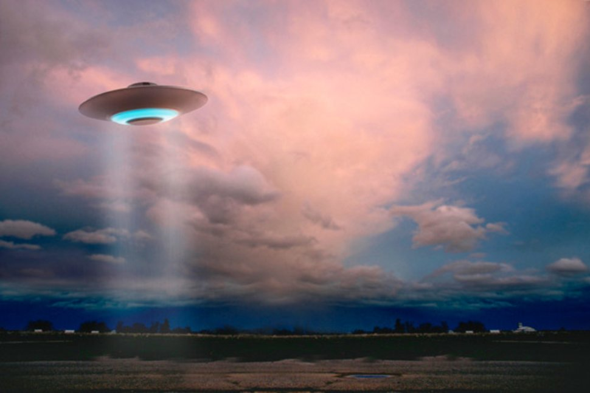

# UFO Sightings Website Design - JavaScript & DOM Manipulation

  

  <a href="https://kiranrangaraj.github.io/UFO-Sightings-Website-Design/">Visit Website</a>

   
---

## Summary ##

A website was created to organize extra-terrestrial eye-witness reports from January 1st - 13th, 2010 into a table that dynamically updates based on filters a user inputs for specific values. The website was built using JavaScript, HTML, CSS, and D3.js. 

---

## Process ##

### Level 1: Automatic Table and Date Search

* Created a basic HTML web page.

* Used the UFO Sightings data set in the form of an array of JavaScript objects to append a table to the web page and added new rows of data for each of UFO sighting.

* Created columns for `date/time`, `city`, `state`, `country`, `shape`, and `comment`.

* Used a date form in the HTML document and wrote JavaScript code that listens for events and searches through the `date/time` column to find rows that match user input.

### Level 2: Multiple Search Categories

* Used multiple user `input` tags, and wrote JavaScript code for the user to set multiple filters and search for UFO sightings using the following criteria based on the table columns:

  1. `date/time`
  2. `city`
  3. `state`
  4. `country`
  5. `shape`

---

## Screenshot ##

  

---

## Sources ##
Data Set
* [UFO Sightings Data](https://github.com/kiranrangaraj/javascript-challenge/blob/master/static/js/data.js)

Images
* [Website Background](https://media2.s-nbcnews.com/j/newscms/2018_01/2280531/180103-ufo-illustration-mn-1015_0758c11fb1637ed3431613cef06cd246.fit-760w.jpg)

---

## Technologies Used ##
* HTML, CSS, JavaScript, D3.js
* PyCharm - Python IDE

---

## Author ##
Kiran Rangaraj - LinkedIn: [@Kiran Rangaraj](https://www.linkedin.com/in/kiranrangaraj/)
